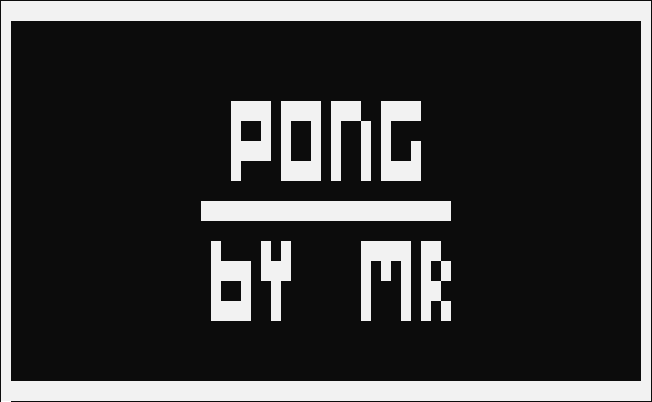
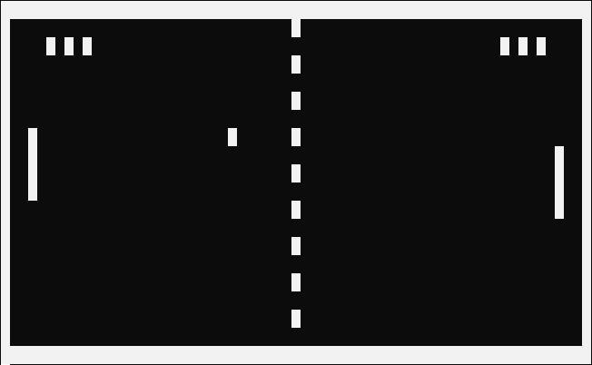

# Pong
This repo contains my implementation of Pong game. It runs in linux terminal.
 
My main goal for this project was to familiarize myself with x86-64 assembly.

## Screenshots

### Main screen:
 
   

### Gameplay:

   

### End screen:

## Running the game
Requirements:
* Linux
* x86-64 CPU

Required software:
* nasm
* make
* gcc

Build the game by running `make all` command in cloned repo directory. Executable will be created in `./bin/pong`.

Controls:
* w - paddle up
* s - paddle down
